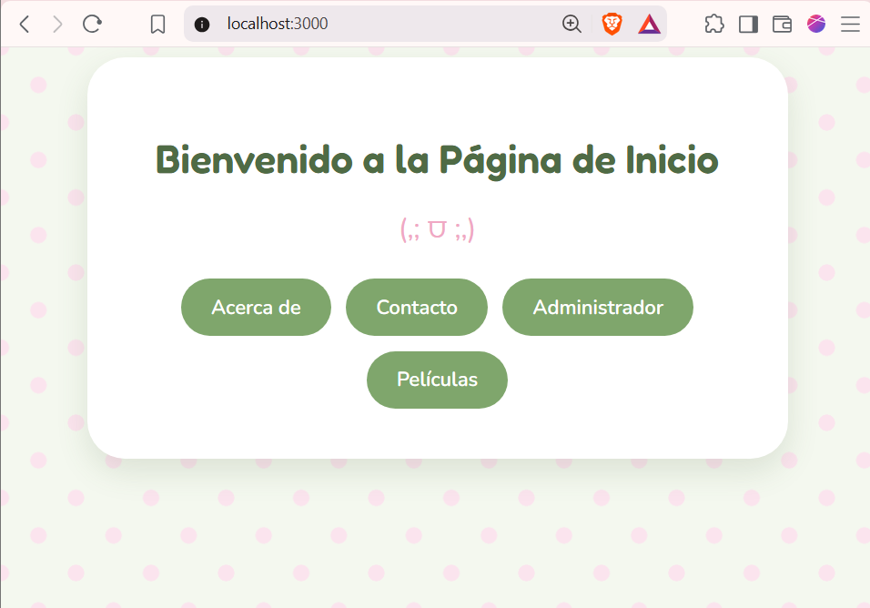
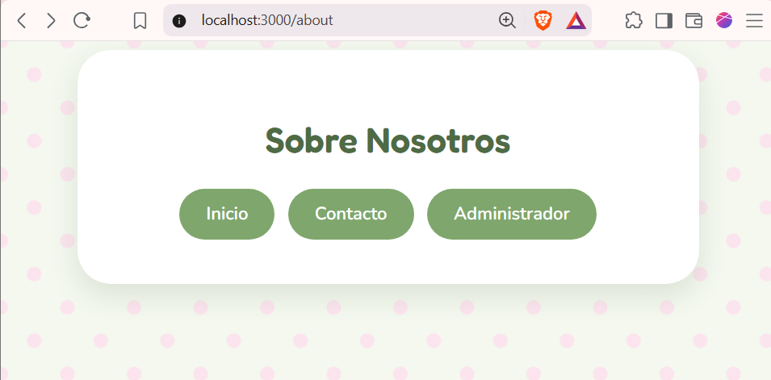
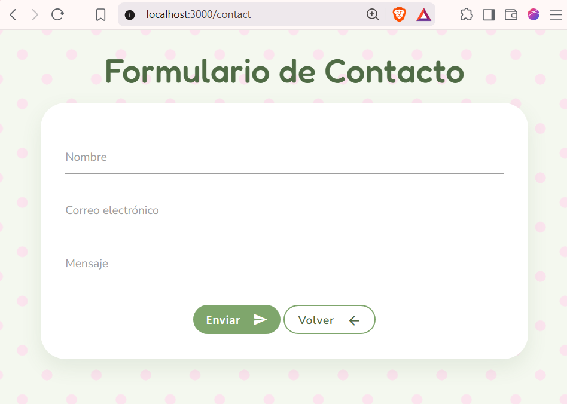
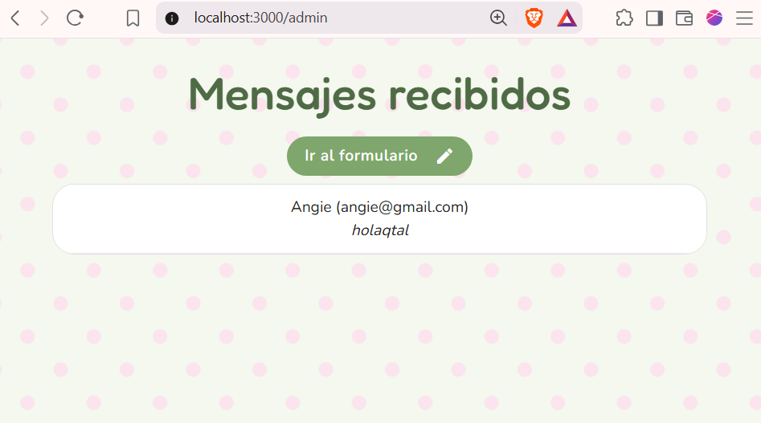
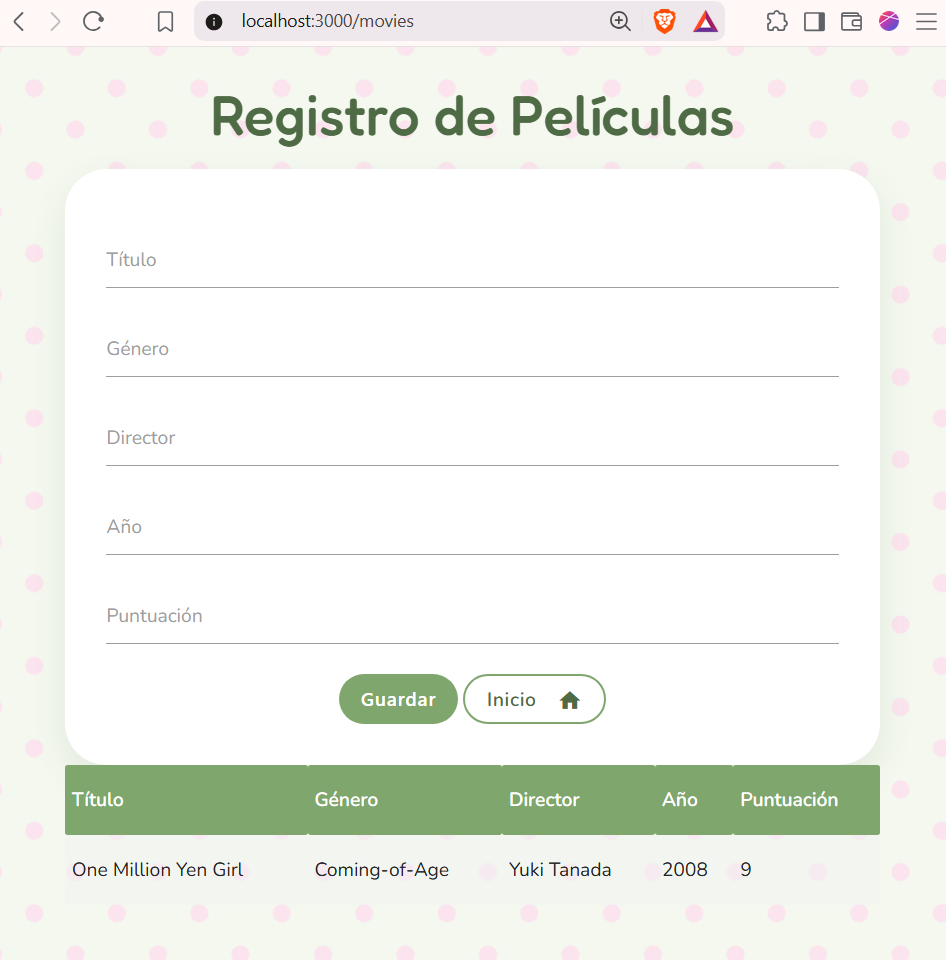
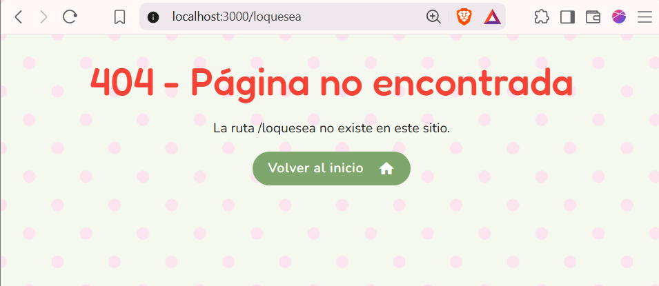

# Mi-sitio-express (,; ⩌ ;,)

Sitio web hecho con **Express** y **EJS** para el laboratorio de Desarrollo de Aplicaciones Web Avanzado. Tema visual: paleta verde salvia y rosa suave, tipografías Fredoka y Nunito.

## ⋆.ᐟ Sobre el laboratorio

- Se agregaron nuevas rutas y vistas (contacto, administrador) siguiendo el patrón MVC básico de controladores separados.
- Se implementó un formulario de contacto que procesa datos con `express.urlencoded` y los guarda en un arreglo en memoria.
- Se creó una vista adicional a libre elección (registro de películas) con su propio controlador, cumpliendo el mínimo de 5 campos pedido.
- Se manejó una ruta 404 personalizada con un middleware al final de `app.js`.
- Como parte extra, se diseñó una identidad visual propia (Vector Garden) en vez de dejar el look por defecto de Materialize, sobrescribiendo sus estilos con un CSS propio.

## ✧ Funcionalidades

- Página de inicio y "Acerca de" con estilo propio
- Formulario de contacto que guarda los mensajes en memoria
- Panel de administrador para ver los mensajes recibidos
- Registro de películas (crear y listar) con Materialize
- Página de error 404 personalizada

## ᶻ 𝗓 𝘇 Tecnologías

- Node.js + Express
- EJS como motor de plantillas
- Materialize CSS (para contact, admin, movies y 404)
- CSS propio para el tema Vector Garden

## 📸 Capturas

**Inicio**



**Acerca de**



**Contacto**



**Administrador**



**Películas**



**Error 404**



## ⋆˙⟡ — Estructura del proyecto

```
mi-sitio-express/
├── controllers/
│   ├── mainController.js
│   └── moviesController.js
├── img/
├── public/
│   └── styles.css
├── routes/
│   └── mainRoutes.js
├── views/
│   ├── home.ejs
│   ├── about.ejs
│   ├── contact.ejs
│   ├── admin.ejs
│   ├── movies.ejs
│   └── notFound.ejs
└── app.js
```

## .ᐟ.ᐟ Cómo correrlo

```bash
npm install
node app.js
```

Luego abre `http://localhost:3000` en tu navegador.

## ⚘ Rutas

| Ruta | Método | Descripción |
|---|---|---|
| `/` | GET | Página de inicio |
| `/about` | GET | Acerca de |
| `/contact` | GET / POST | Formulario y guardado de mensajes |
| `/admin` | GET | Ver mensajes recibidos |
| `/movies` | GET / POST | Registro y listado de películas |
| `*` | — | Cualquier otra ruta cae en la página 404 |